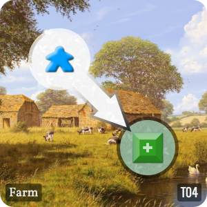
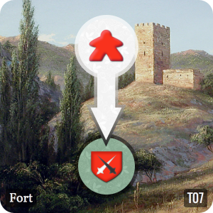
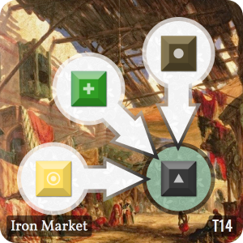
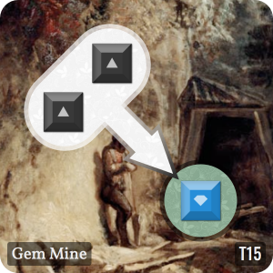
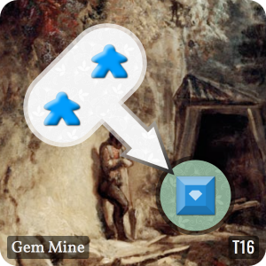

# Town Builder

## Tiles
### T01 : Town Hall - Quantity: 1

When a player has claimed this tile, immediately pass the first player token to this player; that player goes first on the next round.
### T02 : Wood Cutter - Quantity: 2

If the tile has a worker on it, return the worker to the bank and replace with a wood token
### T03 : Mine - Quantity: 2

If the tile has a worker on it, return the worker to the bank and replace with an ore token
### T04 : Farm - Quantity: 2

If the tile has a worker on it, return the worker to the bank and replace with a food token
### T05 : Barracks - Quantity: 2

If the tile has a worker, an iron token, and a gem token, then return all three to the bank and replace with a knight
### T06 : Barracks - Quantity: 2

If the tile has a worker, an iron token, and a gold token, then return all three to the bank and replace with a knight
### T07 : Fort - Quantity: 2

If this tile has a knight, and there is a player with less total knights than you, then steal any two resources from that player, and return this knight to the bank
### T08 : Bakery - Quantity: 2

If the bakery has any food blocks on it, convert each food block to 2 gold in your bank
### T09 : Lumber Mill - Quantity: 2

If the lumber mill has any wood blocks on it, convert each wood block to 2 gold in your bank
### T10 : Blacksmith - Quantity: 2

If the blacksmith has any iron blocks on it, convert each iron block to 2 gold in your bank
### T11 : Market - Quantity: 2

If the market has any wood, iron, or food blocks on it, convert each block to 1 gold in your bank
### T12 : Food Market - Quantity: 2

If the market has any wood, gold, or iron blocks on it, convert each block to a food block in your bank
### T13 : Wood Market - Quantity: 2

If the market has any iron, gold, or food blocks on it, convert each block to 1 wood in your bank
### T14 : Iron Market - Quantity: 2

If the market has any wood, gold, or food blocks on it, convert each block to an iron block in your bank
### T15 : Gem Mine - Quantity: 2

If the tile has a worker on it, return the worker to the bank and replace with an ore token
### T16 : Gem Mine - Quantity: 2

If the tile has a worker on it, return the worker to the bank and replace with an ore token
### T17 : Gem Market - Quantity: 2

If the tile has two gold on it, return the gold to the bank and replace with a gem token
