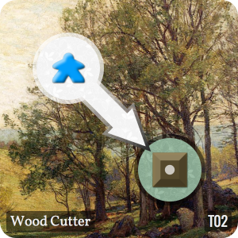
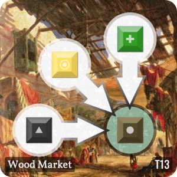

# Town Builder

## Tiles
### T01 : Town Hall - Quantity: 1

When a player has claimed this tile, immediately pass the first player token to this player; that player goes first on the next round.
### T02 : Wood Cutter - Quantity: 2

A player can claim this tile with a worker, and then may claim a wood token from the bank if available.
### T03 : Mine - Quantity: 2

A player can claim this tile with a worker, and then may claim an iron token from the bank if available.
### T04 : Farm - Quantity: 2

A player can claim this tile with a worker, and then may claim a food token from the bank if available.
### T05 : Barracks - Quantity: 2

A player can claim this tile with a worker, when they do, they may exchange a food token, an iron token, and a gem token for a knight from the bank if available.
### T06 : Barracks - Quantity: 2

A player can claim this tile with a worker, when they do, they may exchange a food token, an iron token, and a gold token for a knight from the bank if available.
### T07 : Fort - Quantity: 2

A player can only claim this tile with a knight, if they have one. If there is a player with less knights then you, then you may steal one resource from that player. You may only steal from one player.
### T08 : Bakery - Quantity: 2

A player can claim this tile with a worker, and then may exchange a food token for two gold from the bank if available.
### T09 : Lumber Mill - Quantity: 2

A player can claim this tile with a worker, and then may exchange a wood token for two gold from the bank if available.
### T10 : Blacksmith - Quantity: 2

A player can claim this tile with a worker, and then may exchange an iron token for two gold from the bank if available.
### T11 : Market - Quantity: 2

A player can claim this tile with a worker, and then may exchange either an iron token, a wood token, or a food token, for one gold from the bank if available.
### T12 : Food Market - Quantity: 2

A player can claim this tile with a worker, and then may exchange either a gold token, an iron token, or a wood token, for one food from the bank if available.
### T13 : Wood Market - Quantity: 2

A player can claim this tile with a worker, and then may exchange either an food token, a gold token, or an iron token, for one wood from the bank if available.
### T14 : Iron Market - Quantity: 2

A player can claim this tile with a worker, and then may exchange either an wood token, a food token, or a gold token, for one iron from the bank if available.
### T15 : Gem Mine - Quantity: 2

A player can claim this tile with a worker, and then may exchange two iron tokens, for one gem token from the bank if available.
### T16 : Gem Mine - Quantity: 2

A player may claim this tile with one or two workers; if they claimed the tile with two workers, they may then claim one gem token from bank if available.
### T17 : Gem Market - Quantity: 2

A player may claim this tile with a worker, and then may exchange two gold tokens, for one gem token with the bank if available.
