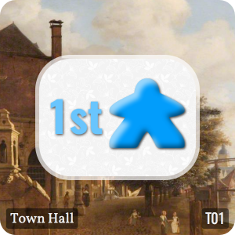
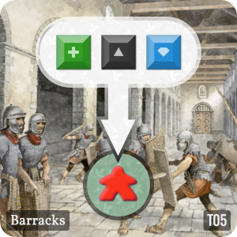
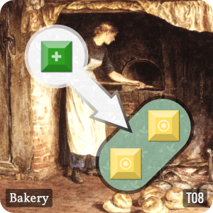
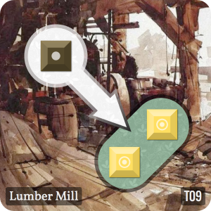
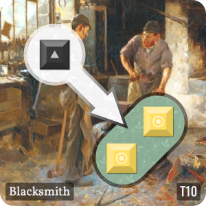
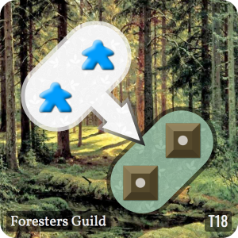
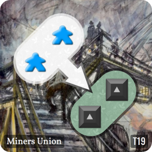
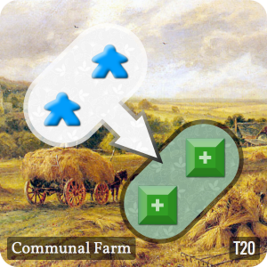

# Town Builder

Town Builder is a turn based worker placement game where players take turns building and running a small medieval town in order to create wealth for themselves.

## Objective

Use your workers to gather resources from the town, scoring points for each type of resource owned at the end of the game.

## Winning

The player with the most points at the end of the game wins. Players score points for each resource they have in their possession at the end of the game. Resources are scored based on the following table:

Resource | Score           | Description
-------- | --------------- | --------------------------
Wood     | 1pt per token   | Brown cube with a circle
Food     | 1pt per token   | Blue cube with a cross
Iron     | 1pt per token   | Black cube with a triangle
Gold     | 1pt per token   | Yellow cube with a donut
Gem      | 2pts per token  | Green cube with a gem
Knight   | 5pts per knight | Large red meeple
Worker   | 0pts per worker | Small blue meeple

## End game

The game ends at the end of the round, after the final tile has been drawn from the _Builder's Stack_ and placed into the town.

## Setup

Players | Starting Workers | Starting Resources
------- | ---------------- | ----------------------
2       | 3                | 1 wood, 1 gold, 1 food
3       | 3                | 1 wood, 1 gold, 1 food
4       | 2                | 1 wood, 1 gold, 1 food
5       | 2                | 1 wood, 1 gold, 1 food

1. Place the _Town Hall_ tile in the centre of the play area.
2. Give each player a number of Worker meeples based on the number of players in the table above.
3. Shuffle the remaining town tiles face down, pick 20 tiles at random and stack them up to the side of the play area in easy reach of all players. This stack is called the _Builder's Stack_.
4. Put any remaining tiles back in the box.
5. Give the _Builder's Token_ to the starting player

## Starting Player

The first player should be the person who most recently bought or sold something.

## Game play

The player with the _Builder's Token_ draws the top tile from the _Builder's Stack_ and places it into the town adjacent to an existing tile.

Starting with the player who has the _Builder's Token_, each player must then either:

1. Place a worker to claim a tile
2. Place a knight (if they own one) and a worker to claim a fort
3. End their turn (and skip any further turns this round)

When a player claims a tile, they may activate that tile provided they have the correct resources. For example, a player can claim a wood cutter to gain a wood token from the bank.

Play continues clockwise until all players have used up their available workers or have ended their turns.

Once all players have ended their turns, the round has ended. Each player should reclaim their knights, and take back the same number of workers that they started the game with.

Play then continues from the player who has the _Builder's Token_, which may have changed due to activation effect of the _Town Hall_ tile.

If there are no more tiles in the _Builder's Stack_ at the start of a round then the game ends.

## Strategy

Players should try and claim resources basic resources using their _Workers_ where possible, such as Wood, Iron, or Food. If players are unable to do this, they can try to sell their goods for a profit.

Players should aim to recruit _Knights_ as soon as possible to protect their resources, and so that they can _Steal_ from unprotected players.

If there is a shortage of a certain type of resource, try trading goods at a market if available.

## Tiles

### T01 : Town Hall - Quantity: 1

When a player has claimed this tile, immediately pass the first player token to this player; that player goes first on the next round. 
### T02 : Wood Cutter - Quantity: 2

A player can claim this tile with a worker, and then may claim a wood token from the bank if available. 
### T03 : Mine - Quantity: 2

A player can claim this tile with a worker, and then may claim an iron token from the bank if available. 
### T04 : Farm - Quantity: 2

A player can claim this tile with a worker, and then may claim a food token from the bank if available. 
### T05 : Barracks - Quantity: 2

A player can claim this tile with a worker, when they do, they may exchange a food token, an iron token, and a gem token for a knight from the bank if available. 
### T06 : Barracks - Quantity: 2

A player can claim this tile with a worker, when they do, they may exchange a food token, an iron token, and a gold token for a knight from the bank if available. 
### T07 : Fort - Quantity: 2

A player can only claim this tile with a knight, if they have one. If there is a player with less knights then you, then you may steal one resource from that player. You may only steal from one player. 
### T08 : Bakery - Quantity: 2

A player can claim this tile with a worker, and then may exchange a food token for two gold from the bank if available. 
### T09 : Lumber Mill - Quantity: 2

A player can claim this tile with a worker, and then may exchange a wood token for two gold from the bank if available. 
### T10 : Blacksmith - Quantity: 2

A player can claim this tile with a worker, and then may exchange an iron token for two gold from the bank if available. 
### T11 : Market - Quantity: 2

A player can claim this tile with a worker, and then may exchange either an iron token, a wood token, or a food token, for one gold from the bank if available. 
### T12 : Food Market - Quantity: 2

A player can claim this tile with a worker, and then may exchange either a gold token, an iron token, or a wood token, for one food from the bank if available. 
### T13 : Wood Market - Quantity: 2

A player can claim this tile with a worker, and then may exchange either an food token, a gold token, or an iron token, for one wood from the bank if available. 
### T14 : Iron Market - Quantity: 2

A player can claim this tile with a worker, and then may exchange either an wood token, a food token, or a gold token, for one iron from the bank if available. 
### T15 : Gem Mine - Quantity: 2

A player can claim this tile with a worker, and then may exchange two iron tokens, for one gem token from the bank if available. 
### T16 : Gem Mine - Quantity: 2

A player may claim this tile with one or two workers; if they claimed the tile with two workers, they may then claim one gem token from bank if available. 
### T17 : Gem Market - Quantity: 2

A player may claim this tile with a worker, and then may exchange two gold tokens, for one gem token with the bank if available. 
### T18 : Foresters Guild - Quantity: 1

A player may claim this tile with one or two workers; if they claimed the tile with two workers, they may then claim two wood tokens from bank if available. 
### T19 : Miners Union - Quantity: 1

A player may claim this tile with one or two workers; if they claimed the tile with two workers, they may then claim two iron tokens from bank if available. 
### T20 : Communal Farm - Quantity: 1

A player may claim this tile with one or two workers; if they claimed the tile with two workers, they may then claim two food tokens from bank if available. 

## Glossary

### Builder's Stack

The _Builder's Stack_ is the stack of tiles used build the town round by round. The game ends at the end of the round when the _Builder's Stack_ is empty. The _Builder's Stack_ is created at the start of the game by shuffling and randomly drawing 20 tiles.

### Builder's Token

The _Builder's Token_ is a physical marker that indicates which player goes first each round. The player with the _Builder's Token_ expands the town and gets to play first each round. Players can claim the _Builder's Token_ for themselves by claiming the _Town Hall_ on their turn.

## Knights

_Knights_ are **large red meeples** that represent armed soldiers who protect resources in your _Warehouse_. You can use your Knights to steal from other players by claiming a _Fort_ on your turn.

At the end of each round, take back your knights to your warehouse. You will score 5 points for each knight you own at the end of the game.

### Resources

See _Tokens_.

### Stealing

_Stealing_ is an action performed by claiming a _Fort_ with a _Knight_ and a _Worker_. When stealing from another player, you must have more _Knight_'s then that player. If you can steal then you may take any one token (Food, Wood, Iron, Gold, or Gem) from that player's warehouse.

### Tokens

There are seven types of tokens in the game; five cubes representing Wood, Food, Iron, Gold, and Gems; large red meeples representing _Knights_, and small blue meeples representing _Workers_.

Tokens represent resources that can be exchanged for other resources by claiming and activating tiles.

### Town Hall

The _Town Hall_ is the starting tile around which the town is built. Any player can claim the _Town Hall_ with a worker in order to take the _Builder's Token_ and go first on the next round.

### Warehouse

Each player has a warehouse where they store their resources. Resources are exchanged with or claimed from the bank by activating tiles with _Workers_.

### Workers

_Workers_ are **small blue meeples** that represent the number of actions you can take per turn. An action is taken by placing your meeple onto a tile in the town, and then optionally activating the tile. Tiles that have been claimed cannot be claimed again until the next round.

At the end of each round, players are returned the same number of _Workers_ that they started the game with.

Because every player starts with the same number of workers, workers are worth 0 points each at the end of the game.
